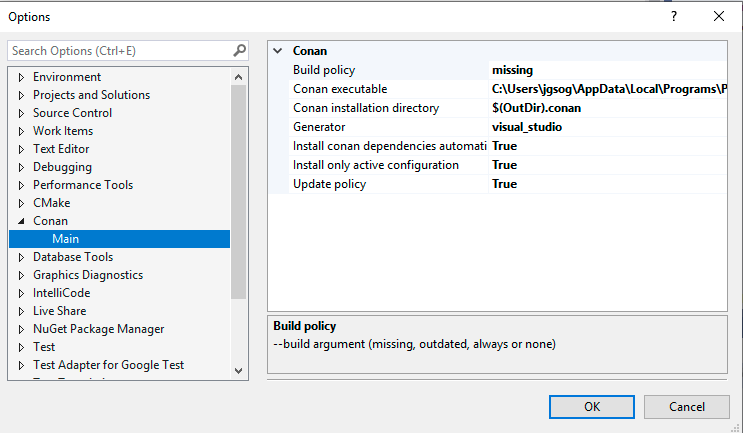

# Conan Extension for Visual Studio

Conan Extension for Visual Studio provides a transparent integration between a Visual Studio
project and the [Conan C/C++ package manager](https://docs.conan.io/en/latest/index.html). It
automates the retrieval of Conan dependencies matching the configuration of the Visual Studio
project and adds the required include directories, linker ones and libraries.

This extension uses under the hood the `visual_studio` generator that Conan provides,
these generators create a _Visual Studio project properties_, the extension includes them
in the corresponding project automatically, so the project has all the information needed
to compile. Read more about these generators in the
[Conan documentation](https://docs.conan.io/en/latest/integrations/build_system/msbuild.html#with-visual-studio-generator).

## Location of conanfile

The extension works for every C++ project in the solution looking for a `conanfile.py` or
`conanfile.txt` file in the directory tree. It starts to look for the file in the folder
where the project is located and then moves up in the directory tree until the root
directory looking for this file.

Once found, it will trigger a [`conan install` command](https://docs.conan.io/en/latest/reference/commands/consumer/install.html)
for the requirements declared in that file using the configuration that matches the
current Visual Studio one (see below).

## Conan configuration

A C++ project requires that all the libraries linked together are compiled using a
compatible configuration, retrieving the proper binaries is one of the key value
propositions of Conan as a package manager for C++.

By default the extension is going to install the binaries using the configuration
autodetected from the Visual Studio project properties. The extension will retrieve the
third party binaries matching architecture, build type and some compiler characteristics
like toolset, version and runtime.

### conan.config
Nevertheless, if you want more fine-grained control over the configuration used by
Conan, you can provide a file with the pairing between the Visual Studio configuration
names and the [Conan profiles](https://docs.conan.io/en/latest/reference/profiles.html).

The file has to be called `conan.config.json`, and the lookup strategy that the Conan extension
uses to find this file is the same as the one used for the `conanfile.py`: it will start
in the folder where the project file is and then walk recursively to parent directories
until the root one.

 The file may contain the following information:

```json
{  
   "configurations": {  
      "Release|Win32": "release_win32",
      "Debug|x64": "debug_x64",
      "Release|Win64": "C:/conan/profiles/release_win64"
   }
}
```

Under the `"configurations"` key there is a dictionary with the correspondence between
the Visual Studio configuration (key, on the left) and a Conan profile (value, on the right).

It is important to take into account:
 * Visual Studio creates the configuration name joining with a `|` character the name
   of the Configuration and the Platform.
 * For Conan profiles, the value declared will be used verbatim for the `--profile` argument
   in the `conan install` command, and rules related to profile lookup applies.


## Extension configuration

There are several options available to the user to configure the extension, all of them can
be accessed through the 'Tools' > 'Conan Package Management' > 'Options...' menu:


